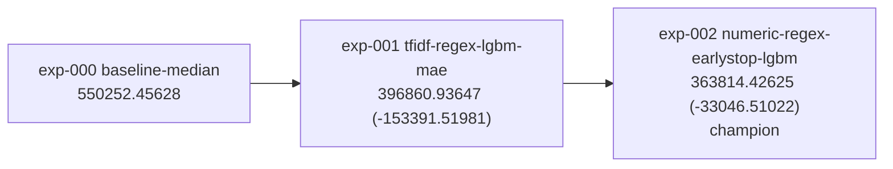

# Experiments

Generated by `tools/lineage.py` -- do not edit by hand.

**Primary metric:** `mae` (minimize)  
**Champion:** exp-002

## Lineage

Any node is a legal fork point. Dead branches are kept deliberately -- they
are what stops the same idea being re-run by a teammate.

## Scores

| exp | slug | parent | cv_primary | cv_std | lb_public | repro | reduced |
|---|---|---|---|---|---|---|---|
| exp-002 | numeric-regex-earlystop-lgbm | exp-001 | 363814.42625 | 18447.46439 | - | pass | yes |
| exp-001 | tfidf-regex-lgbm-mae | exp-000 | 396860.93647 | 21194.65740 | - | pass | no |
| exp-000 | baseline-median | - | 550252.45628 | - | - | pass | no |
